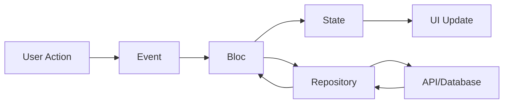
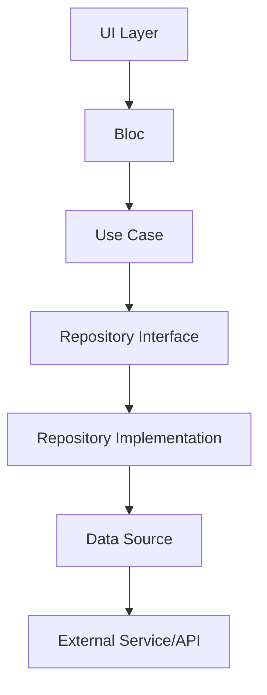

# NeetiFlow Project Structure

## Technical Overview

- **Version**: 0.1.0
- **Dart SDK**: >=3.4.3 <4.0.0
- **Framework**: Flutter
- **Architecture**: Clean Architecture with BLoC Pattern
- **Backend**: Firebase
- **State Management**: flutter_bloc 8.1.3

## Project Map

```mermaid
mindmap
  root((NeetiFlow))
    Application
      ::icon(ðŸ—ï¸)
      Services
        Firebase Initialization
        Authentication Service
        Storage Service
      Configuration
        Environment Config
        Firebase Options
        Route Configuration
    Core
      ::icon(âš™ï¸)
      Constants
        API Endpoints
        Asset Paths
        Route Names
      Utils
        Date Formatters
        String Helpers
        File Handlers
      Extensions
        DateTime Extensions
        String Extensions
        Widget Extensions
      Themes
        Color Schemes
        Typography Styles
        Component Themes
      Validators
        Form Validators
        Input Validators
        Business Rule Validators
      Interfaces
        Repository Interfaces
        Service Interfaces
      Base Classes
        Base Entity
        Base Repository
        Base Bloc
    Data
      ::icon(💾)
      Models
        Employee Model
          Fields
            Basic Info
            Company Details
            Role & Permissions
          Methods
            toJson
            fromJson
            copyWith
        Organization Model
        Department Model
        Client Model
        Lead Model
      Repositories
        Custom Fields Repository
          Field Types
          Field Validation
          Field Groups
        Employee Timeline Repository
          Event Types
          Event Tracking
          Timeline Queries
      DTOs
        Request DTOs
        Response DTOs
        Mapper Classes
    Domain
      ::icon(🎯)
      Entities
        Employee
          Properties
            Personal Info
            Company Info
            Role & Access
          Methods
            Status Management
            Profile Updates
        Organization
          Structure
          Settings
          Permissions
        Department
          Hierarchy
          Roles
          Members
        Client
          Details
          History
          Documents
        Lead
          Information
          Status
          Custom Fields
        Timeline Event
          Event Types
          Metadata
          Timestamps
      Repositories
        Auth Repository
          Authentication
          Authorization
          Session Management
        Employees Repository
          CRUD Operations
          Bulk Operations
          Search & Filter
        Departments Repository
          Structure Management
          Role Assignment
          Department Analytics
        Clients Repository
          Client Management
          Interaction Tracking
          Document Management
      Use Cases
        Employee Management
        Lead Processing
        Client Handling
        Report Generation
      Value Objects
        Email
        Phone
        Address
        CustomField
    Infrastructure
      ::icon(🔧)
      Firebase
        Auth Repository Implementation
          Email Authentication
          Role Management
          Session Handling
        Employees Repository Implementation
          Real-time Updates
          Batch Operations
          Query Optimization
        Departments Repository Implementation
          Hierarchy Management
          Access Control
          Event Tracking
        Clients Repository Implementation
          Document Storage
          Search Implementation
          Backup Strategy
      Services Implementation
        File Storage Service
        Notification Service
        Analytics Service
      External APIs
        Payment Gateway
        Email Service
        SMS Service
    Presentation
      ::icon(🎨)
      Pages
        Auth
          Login Page
            Email Login
            Password Reset
            Error Handling
          Password Reset Page
            Reset Flow
            Validation
            Confirmation
        Home
          Dashboard
            Analytics
            Quick Actions
            Recent Activities
        Employees
          List View
            Filters
            Search
            Bulk Actions
          Details View
            Profile
            Timeline
            Documents
        Leads
          Kanban View
            Status Columns
            Drag & Drop
            Quick Edit
          List View
            Custom Fields
            Advanced Search
            Export
        Clients
          Grid View
            Client Cards
            Quick Actions
            Status Icons
          Details View
            History
            Documents
            Interactions
      Widgets
        Common
          Persistent Shell
            Navigation
            User Profile
            Theme Toggle
          Loading Indicator
            Shimmer Effect
            Progress Bar
            Skeleton Loader
          Error Display
            Error Cards
            Toast Messages
            Dialog Boxes
        Employees
          Timeline Widget
            Event Display
            Filters
            Categories
          Profile Form
            Validation
            Image Upload
            Role Selection
        Leads
          Lead Form
            Dynamic Fields
            Validation
            Auto-save
          Lead List
            Virtual Scroll
            Sort & Filter
            Bulk Actions
      Blocs
        Auth
          States
            Initial
            Loading
            Authenticated
            Error
          Events
            Login
            Logout
            Reset Password
          Effects
            Navigation
            Error Handling
            Session Management
        Employees
          Timeline Management
            Event Tracking
            Real-time Updates
            History Management
          Status Management
            Online/Offline
            Activity Tracking
            Availability
        Custom Fields
          Field Types
            Text
            Number
            Date
            Select
          Validation
            Required Fields
            Format Check
            Custom Rules
      Theme
        Colors
          Primary Palette
          Secondary Palette
          Semantic Colors
        Typography
          Font Families
          Text Styles
          Scale Factors
        Dimensions
          Spacing
          Breakpoints
          Component Sizes
    References
      ::icon(📚)
      Documentation
        API Docs
        Architecture Guide
        Style Guide
      Assets
        Images
        Icons
        Fonts
    Main
      ::icon(🚀)
      App Configuration
        Environment Setup
        Feature Flags
        App Settings
      Route Configuration
        Named Routes
        Guards
        Transitions
      Dependency Injection
        Repositories
        Services
        Blocs
      Firebase Setup
        App Registration
        Security Rules
        Indexes
```

## Dependencies

### Production Dependencies
- **Firebase**
  - firebase_core: ^2.15.1
  - firebase_auth: ^4.9.0
  - cloud_firestore: ^4.9.1
  - firebase_storage: ^11.6.10

- **State Management**
  - flutter_bloc: ^8.1.3
  - bloc: ^8.1.3
  - equatable: ^2.0.5

- **UI Components**
  - flutter_svg: ^2.0.10+1
  - google_fonts: ^6.2.1
  - fl_chart: ^0.63.0
  - table_calendar: ^3.1.0

- **Utils**
  - intl: ^0.19.0
  - logger: ^2.1.0
  - go_router: ^14.6.1
  - timelines: ^0.1.0

### Development Dependencies
- flutter_lints: ^3.0.1
- bloc_test: ^9.1.6
- mockito: ^5.4.4

## Architecture Details

### Clean Architecture Layers

1. **Presentation Layer**
   - Implements MVVM pattern with BLoC
   - Handles UI logic and state management
   - Manages user interactions and navigation

2. **Domain Layer**
   - Contains business logic and rules
   - Defines entity structures and behaviors
   - Specifies repository interfaces

3. **Data Layer**
   - Implements repository interfaces
   - Handles data persistence and caching
   - Manages API communication

4. **Infrastructure Layer**
   - Provides concrete implementations
   - Manages external service integration
   - Handles platform-specific code

### State Management Flow

### Data Flow

## Security Considerations

1. **Authentication**
   - Email/Password authentication
   - Session management
   - Token refresh mechanism

2. **Authorization**
   - Role-based access control
   - Feature-based permissions
   - Data access restrictions

3. **Data Security**
   - Firestore security rules
   - Input validation
   - Data encryption

## Performance Optimizations

1. **UI Performance**
   - Widget rebuilding optimization
   - Lazy loading
   - Image caching

2. **Data Management**
   - Pagination
   - Caching strategy
   - Batch operations

3. **State Management**
   - Efficient state updates
   - Memory management
   - Event debouncing

## Testing Strategy

1. **Unit Tests**
   - Bloc tests
   - Repository tests
   - Use case tests

2. **Widget Tests**
   - Component testing
   - Navigation testing
   - State integration

3. **Integration Tests**
   - End-to-end flows
   - API integration
   - Firebase integration
